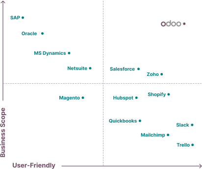

odoo.md

With website 10m visits/month,
Odoo.com in 2024 was rated the <a target="_blank" href="https://www.youtube.com/watch?v=_CxP3Lw_fUo">#9 CRM</a> by Eric Emberling

Odoo in 2024 has 12 million users worldwide.
Shell, McKinsey are customers

In additional to being available as SaaS internet browser, 
Odoo can (uniquely) be installed as "open-source" self-host on-prem.

Odoo also offers a hybrid "odoo.sh".

Odoo aims for the "sweet spot" of both high functionality with ease-of-use.

## The Company

Odoo began in 2005 by founder Fabien Pinckaers, who is now CEO.

Being in Belgium, the software has been internationalized for localization into various dialects of French (BE, CA, CH) and other languages.

Support to partners are from India.

https://www.glassdoor.com/Reviews/Odoo-Reviews-E749314.htm

<a target="_blank" href="https://www.linkedin.com/company/odoo/insights/">LinkeIn reports that</a>
while there has been a 83% 2-year growth in 22-24, the Median employee tenure is 1.6 years.

__ annual conf ???

## Pricing

15 day free trial

Most ERP vendors estimate software should cost about 3% of annual sales.

$3,950 partner fee per year includes $2,600 discounts for internal use 5 users

https://softwareconnect.com/erp/cloud-vs-on-premise/

## Open Source

1. See odoo's repositories

   https://github.com/odoo

1. https://github.com/odoo/odoo/wiki

1. See odoo's odoo repository

   https://github.com/odoo/master/odoo

1. Analyze Issues metrics (Time to First Response, Time to Close, Time in Label):
   https://github.com/github/issue-metrics
   https://www.reddit.com/r/devops/comments/ys5ivs/github_actions_metrics/
   https://github.com/Spendesk/github-actions-exporter
1. Export SBOM about the 102 modules in the Dependency graph

   https://github.com/odoo/odoo/network/dependencies

1. Analyze the SBOM spdx json file.

1. Look up the maintainers' email addresses from the git log and politely inquire about the project's status.

1. Determine the rate of Issue closure  ???

1. Trend of issues

   #165024 transitioning all frontend code from jQuery to Vanilla JavaScript.

1. Use the <a target="_blank" href="https://opensource.stackexchange.com/questions/1753/whats-the-right-way-to-ask-if-a-github-project-is-maintained">"lovely-forks" browser extension</a> to see if the project has any notable forks where development may be continuing.

1. Pull requests: Are they being fixed promptly (<a target="_blank" href="https://opensource.stackexchange.com/questions/1753/whats-the-right-way-to-ask-if-a-github-project-is-maintained">being maintained</a>)?

1. Click Insights to view statistics about it

   Excluding merges, 155 authors have pushed 159 commits to 17.0 and 832 commits to all branches. On 17.0, 866 files have changed and there have been 23,203 additions and 5,528 deletions.

1. Download all branches (which consumed 9.2G on May 8, 2024):

   git clone git@github.com:odoo/odoo.git
   cd odoo
   du -sh

1. Download only the latest master branch, which consumed 1.1G:

   git clone git@github.com:odoo/odoo.git --depth 1

1. Analyze the folders:

   * debian OS folder and setup/rpm/odoo.spec

1. Analyze the requirements.txt using 

## Issues

The commpany has no SOC2/27000 certification.

Never Paid ransomware

After obtaining dependency SBOM from odoo v17.0 at 6f6763b
Run of
osv-scanner scan -S odoo_odoo_6f6763b6728335b0728645806d77a0cb7453ffc7.json
reported vulnerabilities identified at:

[17.0][SEC] Dependency werkzeug 2.0.2 vulnerabilities #165044
[17.0][SEC] Dependency urllib3 1.26.5 vulnerabilities #165045
[17.0][SEC] Dependency pypdf2 1.26.0 & 2.12.1 vulnerabilities #165047
[17.0][SEC] Dependency cryptography 3.4.8 vulnerabilities #165048
[17.0][SEC] Dependency gevent 21.8.0 allows a remote attacker to escalate privileges via a crafted script to the WSGIServer component #165049
[17.0][SEC] Dependency idna 2.10 could consume significant resources, leading to a denial-of-service #165051
[17.0][SEC] Dependency jinja2 3.0.3 & 3.1.2 vulnerabilities #165053
[17.0][SEC] Dependency pillow 9.0.1 & 9.4.0 vulnerabilities #165054
[17.0][SEC] Dependency lxml 4.8.0 denial of service (or application crash) vulnerability #165055

## Partnerships

1. <a target="_blank" href="https://www.odoo.com/education/scale-up-business-game">VIDEO</a>: Play a card game about setting up and scaling a business - 7 business cases of 8 to 10 cards each. $24.78 paper or enter data into https://Odoo.com/scaleup. https://www.odoo.com/scaleup-teacher

1. <a target="_blank" href="https://www.odoo.com/education/odoo-online">Build a business management course and get free unlimited access for 24 months. 

1. Ready Partner 10% - 1 cert, 10 users 6mos
2. Silver 15% - 75 users - 3 certs
3. Gold 20% - 300 users - 6 certs
sh 50% hosting up to 1728/yr /proj - datacenter Wyoming 

## Certification
There is a certification for each major release.
https://www.odoo.com/slides/odoo-17-certification-331
The $250 Odoo 17 Certification online, answer 70% of 120-questions in 1.5 hours about 16 modules (in English or Spanish): 

## Modules

Links to the public demo instance:
1. <a target="_blank" href="https://demo5.odoo.com/odoo/settings?cids=1">Settings</a>
1. <a target="_blank" href="https://demo5.odoo.com/odoo/apps?cids=1">Apps</a>
1. <a target="_blank" href="https://demo5.odoo.com/odoo/dashboards?cids=1&dashboard_id=13">Dashboards</a>

1. <a target="_blank" href="https://demo5.odoo.com/odoo/to-do?cids=1">To-do</a>
1. <a target="_blank" href="https://demo5.odoo.com/odoo/discuss?cids=1">Discuss</a>
1. <a target="_blank" href="https://demo5.odoo.com/odoo/knowledge/33?cids=1">Knowledge</a>
1. <a target="_blank" href="https://demo5.odoo.com/odoo/documents?cids=1">Documents</a>

1. <a target="_blank" href="https://demo5.odoo.com/odoo/contacts?cids=1">Contacts</a>
1. <a target="_blank" href="https://demo5.odoo.com/odoo/employees?cids=1">Employees</a>
1. <a target="_blank" href="https://demo5.odoo.com/odoo/recruitement?cids=1">Recruitment</a>

1. <a target="_blank" href="https://demo5.odoo.com/odoo/appointments?cids=1">Appointments</a>
1. <a target="_blank" href="https://demo5.odoo.com/odoo/calendar?cids=1">Calendar</a>
1. <a target="_blank" href="https://demo5.odoo.com/odoo/time-off?cids=1">Time Off</a>

1. <a target="_blank" href="https://demo5.odoo.com/odoo/project?cids=1">Projects</a>

1. <a target="_blank" href="https://demo5.odoo.com/">Website</a>
1. <a target="_blank" href="https://demo5.odoo.com/odoo/events?cids=1">Events</a>
1. <a target="_blank" href="https://demo5.odoo.com/odoo/email-marketing?cids=1">Email Marketing</a>

1. <a target="_blank" href="https://demo5.odoo.com/odoo/crm?cids=1">CRM</a> (Customer Relationship Management)
1. <a target="_blank" href="https://demo5.odoo.com/odoo/sales?cids=1">Sales</a>
1. Gamification
1. <a target="_blank" href="https://demo5.odoo.com/odoo/sign?cids=1">Sign</a>

1. <a target="_blank" href="https://demo5.odoo.com/odoo/subscriptions?cids=1">Subscriptions</a>
1. <a target="_blank" href="https://demo5.odoo.com/odoo/rental?cids=1">Rentals</a>
1. <a target="_blank" href="https://demo5.odoo.com/odoo/action-1097?cids=1">Kitchen Display</a> ???
1. <a target="_blank" href="https://demo5.odoo.com/odoo/field-service?cids=1">Field Service</a>

1. <a target="_blank" href="">eCommerce</a> (shopping, payments, Stripe, PayPal)
1. <a target="_blank" href="https://demo5.odoo.com/odoo/point-of-sale?cids=1">POS</a> (Point of Sale Registers) 
1. <a target="_blank" href="https://demo5.odoo.com/odoo/helpdesk?cids=1">Helpdesk</a> Tickets

1. <a target="_blank" href="https://demo5.odoo.com/odoo/expenses?cids=1">Expenses</a>
1. <a target="_blank" href="https://demo5.odoo.com/odoo/purchase?cids=1">Purchase</a> (Payables???)
1. <a target="_blank" href="https://demo5.odoo.com/odoo/accounting?cids=1">Accounting</a>
1. <a target="_blank" href="https://demo5.odoo.com/odoo/inventory?cids=1">Inventory</a>
1. <a target="_blank" href="https://demo5.odoo.com/odoo/work-centers?cids=1">Manufacturing</a> (MRP)
1. <a target="_blank" href="https://demo5.odoo.com/odoo/shop-floor?cids=1">Shop Floor</a>

1. <a target="_blank" href="https://demo5.odoo.com/odoo/employees-planning?cids=1">Planning</a> (Schedules)
1. <a target="_blank" href="https://demo5.odoo.com/odoo/timesheets?cids=1">Timesheets</a>

1. <a target="_blank" href="">Spreadsheet</a> ???
1. <a target="_blank" href="">Survey</a> ???

No werehousing

<a target="_blank" href="https://apps.odoo.com/apps/modules/category/Addon/browse">40,000 community-developed apps</a> by
* <a target="_blank" href="https://apps.odoo.com/apps/modules/16.0/smile_audit/">Audit Trail</a> of create, write, unlink methods.
* <a target="_blank" href="https://apps.odoo.com/apps/modules/browse?author=Almighty%20Consulting%20Solutions%20Pvt.%20Ltd.">210 for hospitals</a> <a target="_blank" href="https://www.almightycs.com">Almighty Consulting</a> Gujurat, India - 

ERP?

vs https://opensaas.sh/

## Consultants

177 partners in us vs 3000 worldwide

https://www.upwork.com/freelancers/~01f688ac2ee5f3320a
$95/hr Andrew H. 
Garden Valley, ID 

https://www.upwork.com/freelancers/asimzaidi
$45/hr Asim Z.

## API

<a target="_blank" href="https://www.odoo.com/documentation/17.0/developer/reference/external_api.html">Odoo documentation</a> explains how to do XMLRPC.
But JSON will be used for controllers.

https://github.com/OCA/odoorpc
Python module to pilot your Odoo servers through JSON-RPC.

https://mart-e.be/2024/01/utiliser-api-odoo-python
calling RPC 

by <a target="_blank" href="https://www.linkedin.com/in/martintrigaux/">Martin Trigaux</a>,
developer at Odoo

https://softwareconnect.com/erp/cloud-vs-on-premise/
Decision Tree